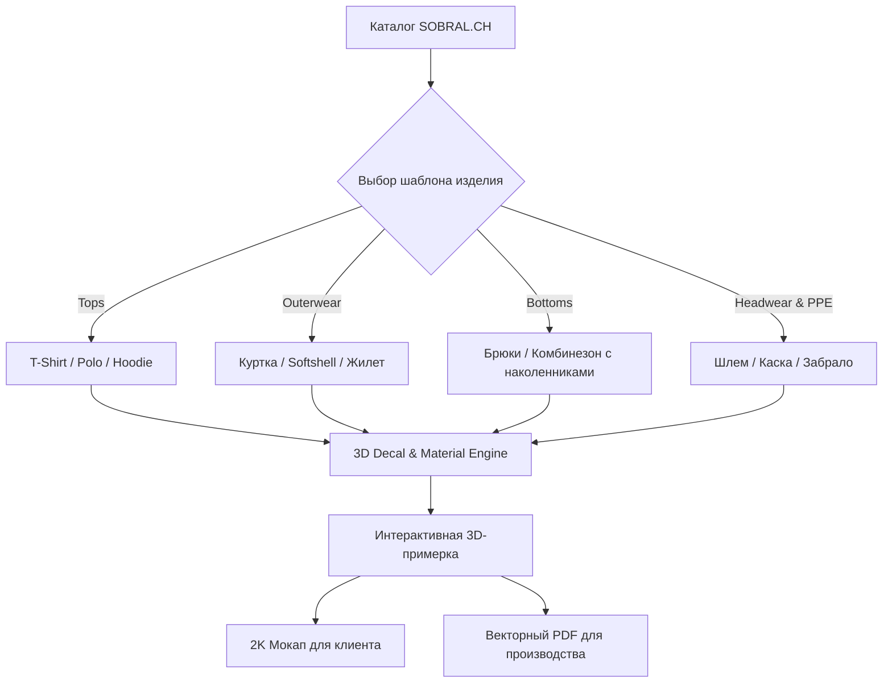

# 🚀 SOBRAL 3D Custom Studio
## Презентация проекта и план масштабирования на весь ассортимент

> **Цель проекта:** Создание промышленного интерактивного 3D-конфигуратора спецодежды и экипировки для **SOBRAL.CH**, автоматизирующего процесс примерки, брендирования, согласования и подготовки заказов к производству.

---

## 📌 1. Текущие результаты (Что уже реализовано в MVP)

```
[ Пользователь / Фото ] ──> [ AI Photo-Analyzer ] ──> [ Three.js 3D Studio ] ──> [ 2K Mockup & Specs ]
```

### ✅ Технические достижения:
1. **Интерактивное 3D-ателье (Three.js WebGL)**:
   - Вращение 360°, зум, интуитивное перемещение логотипов и надписей мышью прямо по 3D-модели.
   - Фирменная футболка **SOBRAL Workwear** с официальным SVG-логотипом на груди и надписью на спине при старте.
2. **AI & Фото-реконструкция (`PhotoAnalyzer`)**:
   - Автоматическое определение силуэтов: **T-Shirt, Sleeveless Tank Top, Shorts, Hoodie**.
   - Точное извлечение реальных цветов с фотографий (включая чистый белый `#FFFFFF` и фирменные палитры).
   - Динамический 3D альфа-вырез для маек без рукавов (Tank Top).
3. **Фотореализм и PBR-материалы**:
   - Генерация нормалей хлопковой ткани (Normal Map), имитация плетения трикотажа, микро-тени и риббинг воротника.
4. **Экспорт без обрезки и искажений**:
   - Генерация HD-снимков ракурсов (Front / Back) и итогового **2K Production Mockup** с полным охватом изделия.
5. **Инфраструктура и UX**:
   - Полная мультиязычность (**DE / EN**) в реальном времени.
   - Швейцарский фирменный дизайн в стиле **SOBRAL.CH**.
   - Синхронизация с **GitHub** (`MelomanMd/3d-sobral`) и **Bitbucket** (`breakmedia/3d-sobral`) + авто-билд Vite.

---

## 🏗 2. Архитектура масштабирования на весь ассортимент
*(Куртки, Зимняя спецодежда, Комбинезоны, Защитные каски/шлемы, Спецобувь)*

### 🔍 Ключевые вызовы и решения:

| Вызов | Решение |
| :--- | :--- |
| **Сложная геометрия (карманы, молнии, капюшоны, наколенники)** | **Составные суб-меши (Modular Submeshes):** карманы, светоотражающие ленты 3M и молнии выносятся в отдельные 3D-узлы. Их можно красить отдельно и включать/выключать чекбоксами в UI. |
| **Печать на изогнутых поверхностях (шлемы, рукава)** | **3D Decal Projection (`DecalGeometry`):** прямое проецирование векторных логотипов на любую криволинейную 3D-поверхность без деформаций и искажений. |
| **Физика материалов (PBR)** | Разделение шейдеров: матовая влагозащитная ткань (Softshell/Gore-Tex), глянцевый пластик касок, металлический блеск светоотражателей. |
| **Производственный экспорт** | Генератор **Print-Ready PDF Specification** с точными координатами в мм, номерами Pantone/RAL/CMYK и векторными логотипами. |



---

## ⏱ 3. План реализации и сроки (Roadmap)

```
[ Этап 1: Decals & Архитектура ] ────► 2 недели
[ Этап 2: 3D-Пак базовых моделей ] ──► 2-3 недели
[ Этап 3: Конфигуратор карманов ] ───► 1.5-2 недели
[ Этап 4: Экспорт PDF & Интеграция ] ─► 1.5-2 недели
─────────────────────────────────────────────────────────────
ИТОГО (Полный производственный релиз): ~2 — 2.5 месяца
```

### Детализация этапов:

- **Спринт 1: Движок 3D Decals & Модульная система (1.5 – 2 недели)**:
  - Внедрение `Three.js DecalGeometry` для идеального нанесения логотипов на шлемы, рукава и карманы.
  - Поддержка независимых красимых узлов (карманы, молнии, полосы).
- **Спринт 2: 3D-моделирование базовых силуэтов (2 – 3 недели)**:
  - 5 ключевых категорий: Зимняя куртка, Softshell, Комбинезон (Dungarees), Каска/Шлем, Спецобувь.
  - Оптимизация (Low-Poly до 15k, чистые UV, Ambient Occlusion).
- **Спринт 3: UI-конфигуратор элементов (1.5 – 2 недели)**:
  - Панель выбора опций: тип карманов, светоотражающие ленты 3M, капюшон, швы.
- **Спринт 4: Production PDF & Интеграция (1.5 – 2 недели)**:
  - Генерация печатных бланков с точными размерами в см и номерами Pantone.
  - Встраивание в карточки товаров сайта `sobral.ch`.

---

## 💼 4. Бизнес-эффект для SOBRAL.CH

1. ⚡ **Ускорение B2B-продаж в 5 раз**: клиент видит готовый брендированный комплект (куртка + шлем + брюки) прямо на сайте за 30 секунд без ожидания макетов от дизайнера.
2. 🎯 **0 ошибок в производстве**: фабрика получает точный производственный лист с координатами и цветами.
3. 🏆 **Конкурентное преимущество**: SOBRAL становится первым швейцарским поставщиком спецодежды с полноценным 3D-конфигуратором такого уровня.

---

### 🔗 Ресурсы проекта:
- **GitHub:** [https://github.com/MelomanMd/3d-sobral](https://github.com/MelomanMd/3d-sobral)
- **Bitbucket:** [https://bitbucket.org/breakmedia/3d-sobral](https://bitbucket.org/breakmedia/3d-sobral)
- **Демо:** Запущено локально на порту `5173` и развернуто на Netlify.
